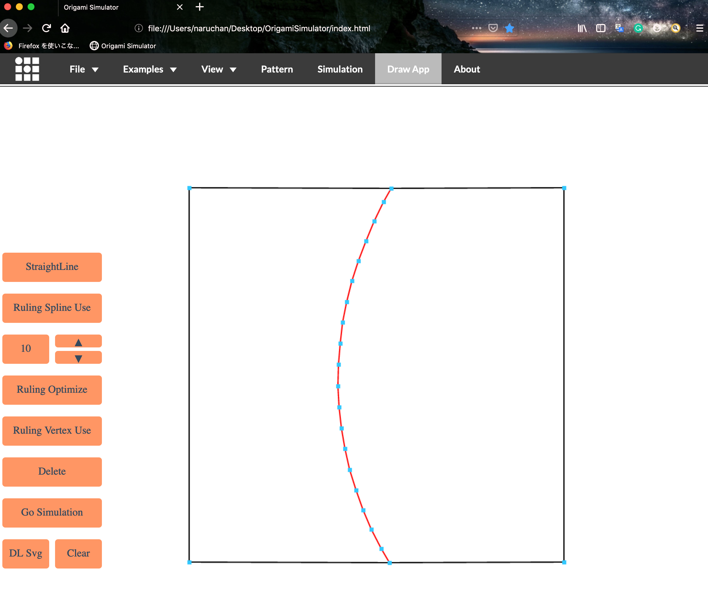
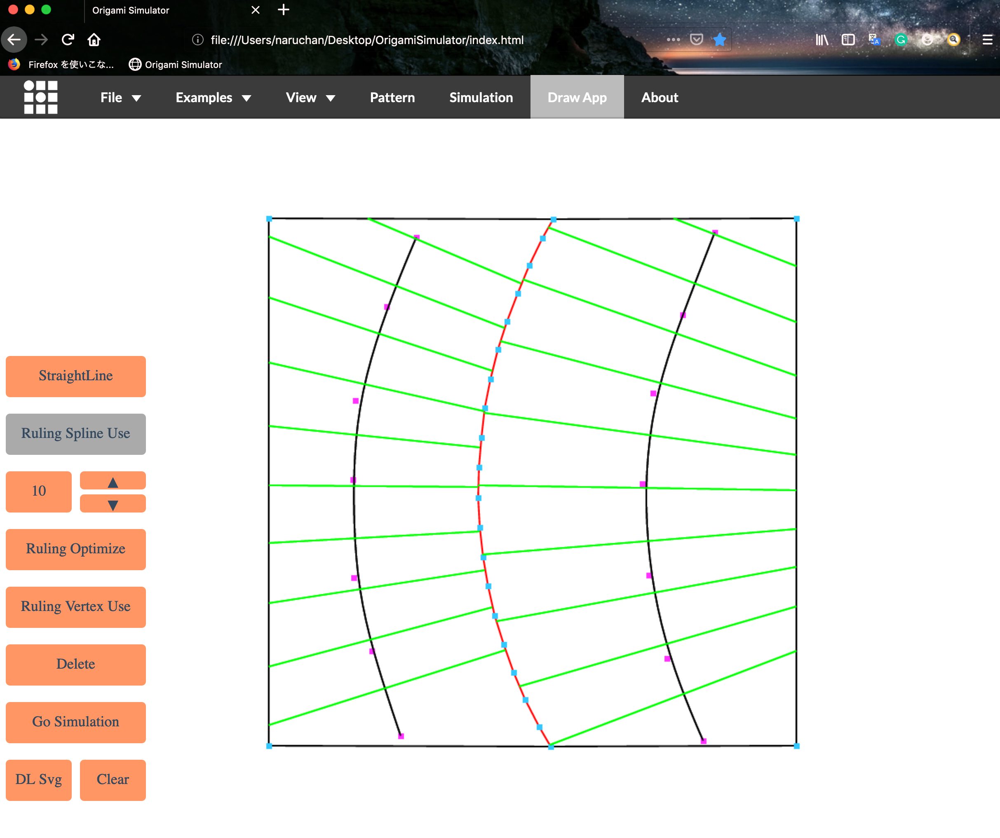
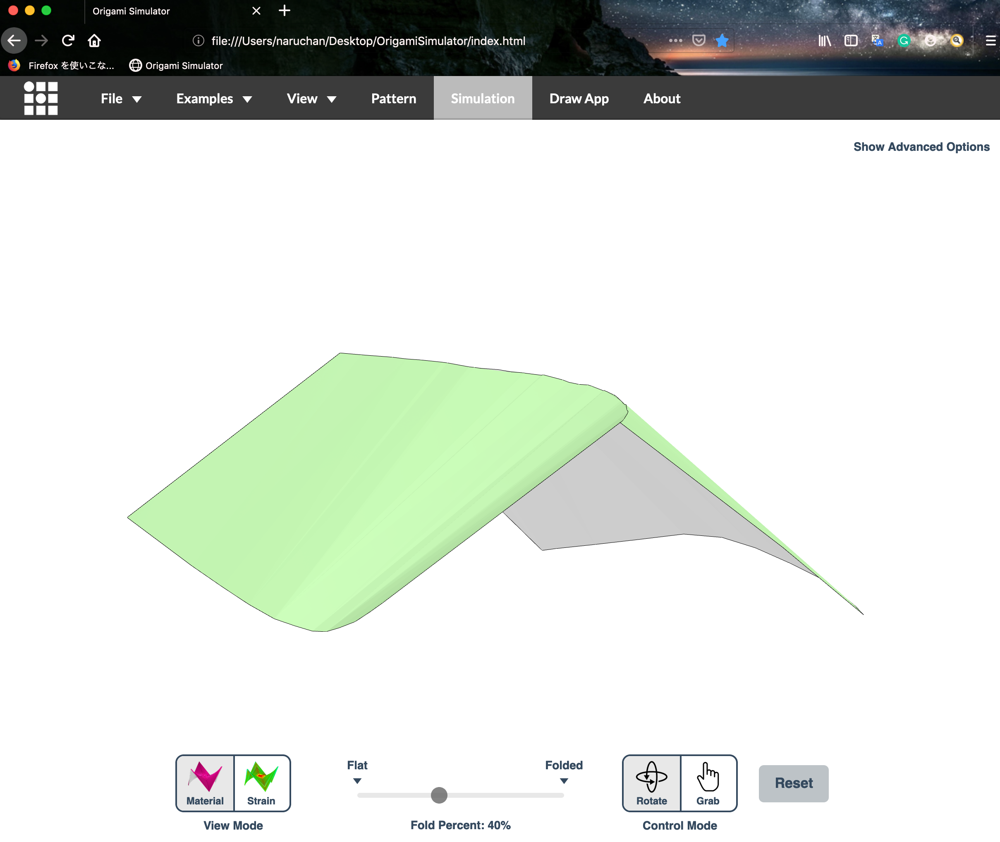

# Origami Simulator[Ghassaei et. al 2017]を、研究のために使わせていただいております。

　近年注目を集めつつある曲線折り紙は、既存のシミュレータでは上手くシミュレートすることができません。曲線折りに対応したシミュレータが今の所存在しないからです。
　既存のシミュレータにて、曲線折り紙の折りの動作シミュレーション行う場合、入力となる展開図に分割線情報をあらかじめ与える必要があります。一般的な方法では、既存のドローイングソフトウェア(Illustratorなど)で一本ずつ手作業で描画することが挙げられます。しかし、このような操作を施してからシミュレータに入力する操作は冗長であると考えます。

　そこで私は、折りのシミュレーションを行いながら展開図に分割線情報を追加、削除する機能をOrigami Simulatorに追加することで、曲線折り紙の折り動作のシミュレーションの効率化を図ります。具体的には、Illustratorなどで行なっていた操作をOrigami Simulatorないで行えるようにします。これにより、展開図を入力する過程、また展開図を修正した後の再入力の際の時間的コストを大幅に削減できると考えます。

曲線折り紙の展開図例
 

シミュレート結果
多角形パネルが内部で三角形分割されるため、可展面の自然な形状が表現できない場合が多い
 

シミュレータ内で分割線情報を入力可能に
 

再シミュレート結果は目的の形状を表現することができている
 

以下、Amandaさんのreadmeです。

# OrigamiSimulator

Live demo at <a href="http://apps.amandaghassaei.com/OrigamiSimulator">apps.amandaghassaei.com/OrigamiSimulator</a> 

This app allows you to simulate how any origami crease pattern will fold.  It may look a little different
from what you typically think of as "origami" - rather than folding paper in a set of sequential steps,
this simulation attempts to fold every crease simultaneously. It does this by iteratively solving for small displacements in the geometry of an initially flat sheet due to forces
exerted by creases.  This solver extends work from the following sources:   
&nbsp;&nbsp;&nbsp;&nbsp;<a target="_blank" href="http://www2.eng.cam.ac.uk/~sdg/preprint/5OSME.pdf">Origami Folding: A Structural Engineering Approach</a> by Mark Schenk and Simon D. Guest 
&nbsp;&nbsp;&nbsp;&nbsp;<a target="_blank" href="http://www.tsg.ne.jp/TT/cg/TachiFreeformOrigami2010.pdf">Freeform Variations of Origami</a> by Tomohiro Tachi 
 
All simulation methods were written from scratch and are executed in parallel in several GPU fragment shaders for fast performance.

 
<b>Instructions:</b>  
 
<ul>
    <li>Slide the <b>Fold Percent</b> slider to control the degree of folding of the pattern (100% is fully folded, 0% is unfolded,
        and -100% is fully folded with the opposite mountain/valley assignments).</li>
    <li>Drag to rotate the model, scroll to zoom.</li>
    <li>Import other patterns under the <b>Examples</b> menu.</li>
    <li>Upload your own crease patterns in SVG or <a href="https://github.com/edemaine/fold" target="_blank">FOLD</a> formats, following the instructions under <b>File > File Import Tips</b>.</li>
    <li>Export FOLD files or 3D models ( STL or OBJ ) of the folded state of your design ( <b>File > Save Simulation as...</b> ).</li>
    </ul>
        
    <ul>
    <li>Visualize the internal strain of the origami as it folds using the <b>Strain Visualization</b> in the left menu.</li>
    </ul>
         
    <ul>
    <li>If you are working from a computer connected to a Vive, follow the instructions near the <b>VR</b> menu
        to use this app in an interactive virtual reality mode.</li>
</ul>

 

<b>External Libraries:</b>  
<ul>
    <li>All rendering and 3D interaction done with <a target="_blank" href="https://threejs.org/">three.js</a></li>
    <li><a href="https://www.npmjs.com/package/path-data-polyfill" target="_blank">path-data-polyfill</a> helps with SVG path parsing</li>
    <li><a href="https://github.com/edemaine/fold" target="_blank">FOLD</a> is used as the internal data structure, methods from the
        <a href="https://github.com/edemaine/fold/blob/master/doc/api.md" target="_blank">FOLD API</a> used for SVG parsing</li>
    <li>Arbitrary polygonal faces of imported geometry are triangulated using the <a target="_blank" href="https://github.com/mapbox/earcut">Earcut Library</a></li>
    <li>GIF and WebM video export uses <a target="_blank" href="https://github.com/spite/ccapture.js/">CCapture</a></li>
    <li>Portability to multiple VR controllers by <a target="_blank" href="https://github.com/stewdio/THREE.VRController">THREE.VRController.js</a></li>
    <li>VR GUI by <a href="https://github.com/dataarts/dat.guiVR" target="_blank">dat.guiVR</a></li>
    <li><a href="http://www.numericjs.com/" target="_blank">numeric.js</a> for linear algebra operations</li>
    <li><a href="https://github.com/eligrey/FileSaver.js/" target="_blank">FileSaver</a> for client-side file saving</li>
    <li><a target="_blank" href="https://jquery.com/">jQuery</a>, <a target="_blank" href="http://getbootstrap.com/">Bootstrap</a>, and the
        <a target="_blank" href="http://designmodo.github.io/Flat-UI/">Flat UI theme</a> used to build the GUI</li>
</ul>

 
Built by <a href="http://www.amandaghassaei.com/" target="_blank">Amanda Ghassaei</a> as a final project for <a href="http://courses.csail.mit.edu/6.849/spring17/" target="_blank">Geometric Folding Algorithms</a>.
Code available on <a href="https://github.com/amandaghassaei/OrigamiSimulator" target="_blank">Github</a>.  If you have interesting crease patterns that would
make good demo files, please send them to me (Amanda) so I can add them to the <b>Examples</b> menu.  My email address is on my website.  Thanks! 
 
More documentation coming soon - I'm preparing a paper about the simulation methods used here, I will post it once its ready.
                    For now, find some additional info <a href="http://www.amandaghassaei.com/projects/origami_simulator/" target="_blank">here</a>. 
